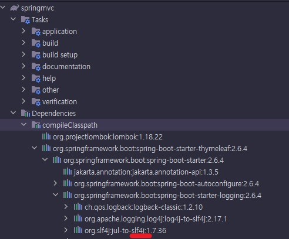
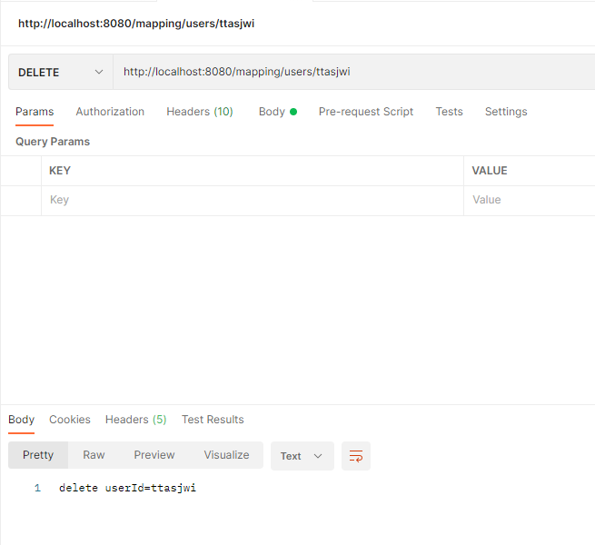

---

# Spring MVC

김영한 님의 "스프링 MVC 1편 - 백엔드 웹 개발 핵심 기술" 강의 코드를 따라치면서 간략하게나마 학습정리를 조금씩 하기 위한 Repository

---

### 프로젝트 환경

- jdk : 11
- IDE : intelliJ Ultimate
- 빌드 : gradle, Spring Boot
```groovy
dependencies {
	implementation 'org.springframework.boot:spring-boot-starter-thymeleaf'
	implementation 'org.springframework.boot:spring-boot-starter-web'
	compileOnly 'org.projectlombok:lombok'
	annotationProcessor 'org.projectlombok:lombok'
	testImplementation 'org.springframework.boot:spring-boot-starter-test'
}
```
- 의존 라이브러리
  - lombok
  - spring-boot-starter-web
  - spring-boot-starter-thymeleaf

---

### welcome 페이지
`resources/static/index.html` : 강의 실습 코드들 실행 결과 `view`를 한 페이지에 모아둠

---

## Logger

```
2022-03-04 11:04:35.611  WARN 30252 --- [nio-8080-exec-1] c.t.springmvc.basic.LogTestController    :  warn log=spring
2022-03-04 11:04:35.611 ERROR 30252 --- [nio-8080-exec-1] c.t.springmvc.basic.LogTestController    : error log=spring
```
- sout과 같이 무조건적으로 로그에 콘솔에 찍어내리는 메서드를 사용하지 않고, 필요 레벨에 따라 콘솔에 로그를 출력하기 위함
- 별도의 설정시, 로그를 파일/네트워크 등의 위치에 별도로 로그를 남길 수 있음. (심지어 파일로 남길 경우 로그 분할/백업 등의 기능도 지원됨.)
- 출력 포맷 : 시간, 레벨, PID, 스레드명, 클래스명, 로그 메시지
- sout보다 성능이 더 좋음(내부 버퍼링, 멀티 스레드, ...)

<details>
<summary>세부적인 사용법(접기/펼치기)</summary>
<div markdown="1">




- 스프링부트에서는 기본적으로 로깅 라이브러리로 slf4j를 제공함
  - 인터페이스 : slf4j
  - 구현체 : Logback
```properties
##root 경로와 그 하위 로그 레벨 설정을 info로(기본값)
logging.level.root=info

##com.ttasjwi.springmvc 패키지와 그 하위 로그 레벨 설정
logging.level.com.ttasjwi.springmvc=debug
```
- 로그 레벨을 설정파일에서 조절 가능. (application.properties, yml, ...)
- `logging.level.패키지경로...=레벨` : 로길 레벨 조정(패키지 경로 및 그 하위에 대하여)
- 디폴트로 `root` 경로의 로그 레벨은 info로 잡혀있음.
- root의 레벨을 info 아래로 두면 라이브러리 수준의 로그까지 다 잡혀버림... 보통은 root 경로는 info로 두고, 하위 경로에서 필요에 따라 debug 수준으로 잡음

```java
//@Slf4j 롬복이 자동으로 Logger를 log 변수에 생성해줌
//@Controller : 일반적으로 반환타입이 view
@RestController // Http 응답 Body에 반환
public class LogTestController {

    private final Logger log = LoggerFactory.getLogger(getClass());

    @RequestMapping("/log-test")
    public String logTest() {
        String name = "spring";

        //log.trace("trace log="+name); 문자열 결합 : 로그에 안 찍히는데도 실제로 연산을 수행하는 비용이 발생함. 쓰지 말 것
        log.trace("trace log={}", name); // 로그의 설정 레벨보다 낮을 경우 실행조차 되지 않음.
        log.debug("debug log={}", name);
        log.info(" info log={}", name);
        log.warn(" warn log={}", name);
        log.error("error log={}", name);
        return "ok";
    }

}
```
- 로거 생성시 `LoggerFactory.getLogger(클래스)`을 통해 Logger를 받아온뒤 사용 가능
  - 롬복에서 지원하는 `@Slf4j` 어노테이션을 달아주면 위의 작업을 자동으로 수행해줌.("log" 변수로 받아옴)
- 로깅 레벨을 trace, debug, info, warn, error 수준으로 지정할 수 있음.
  - debug : 주로 개발 단계에서 사용
  - info : 주로 배포, 운영 단계에서 사용

### 잘못된 로그 사용법
```java
log.trace("trace log="+name);
```
- 설정된 레벨보다 낮은 레벨의 로그라서 출력되지 않더라도 실제로 문자열 결합 연산이 수행되는 비용이 발생함

### 올바른 로그 사용법
```java
log.trace("trace log={}",name);
```
- 설정된 레벨보다 낮은 로그의 경우 실행되지 않음


</div>
</details>


---

## 요청 매핑
- Http 요청의 URL(URI, PathVariable), 파라미터, 메서드, 여러가지 헤더를 지정하여 매핑되는 요청을 제한 가능

<details>
<summary>세부적인 사용법(접기/펼치기)</summary>
<div markdown="1">

### @RestController
```java
@RestController
public class MappingController {
```
- `@RestController` : 클래스 앞에 선언. 모든 메서드의 반환 값에 대하여 반환 값으로 뷰를 찾지 않고, 반환객체를 HTTP 바디에 바로 입력

### @RequestMapping
```java
@RequestMapping(value="/mapping-get-v1", method = RequestMethod.GET)
public String mappingGetV1() {
    log.info("mappingGetV1");
    return "ok";
}
```
```java
@GetMapping(value="/mapping-get-v2")
public String mappingGetV2() {
    log.info("mappingGetV2");
    return "ok";
}
```
- value(디폴트) : url URL 호출이 오면 이 메서드가 실행되도록 함
  - 배열로 지정시 다중 설정 가능(예: `{"/hello-basic", "/hello-go"}`)
- method(메서드) : HTTP 메서드. 축약된 어노테이션이 따로 존재하는데, 현업에선 이들을 주로 사용
  - GET -> `@GetMapping`
  - POST -> `@PostMapping`
  - PUT -> `@PutMapping`
  - PATCH -> `@PatchMapping`
  - DELETE -> `@DeleteMapping`


### @RequestMapping - PathVariable
```java
@GetMapping("/mapping/{userId}")
public String mappingPath(@PathVariable String userId) {
    log.info("mappingPath userId={}", userId);
    return "ok";
}
```
```java
@GetMapping("/mapping/users/{userId}/orders/{orderId}")
public String mappingPath(@PathVariable String userId, @PathVariable Long orderId) {
    log.info("mappingPath userId={}, orderId={}", userId, orderId);
    return "ok";
}
```
- 파라미터 앞에, `@PathVariable("경로변수명")`을 지정하여 요청의 경로변수를 사용할 수 있음
- 변수명이 같으면 ()를 생략해도 된다. 
  - 예) @PathVariable("userId") String userId -> @PathVariable userId
- 복수의 `pathVariable`도 사용 가능하다.

### @RequestMapping - 특정 Parameter
```java
@GetMapping(value="/mapping-param", params="mode=debug")
public String mappingParam() {
    log.info("mappingParam");
    return "ok";
}
```
- 특정 파라미터가 있거나 없는 조건식을 추가할 수 있음. 잘 사용되진 않는다.
  - "mode" - 모든 mode 파라미터에 대해
  - "!mode" - mode가 아닌 파라미터
  - "mode=debug" : mode가 debug일 때
  - "mode!=debug" : mode가 debug가 아닐 때
- 배열로 지정할 경우 `or`로 취급됨.
  - `params = {"mode="debug","data="good"}`

### @RequestMapping - 특정 Header
```java
@GetMapping(value="/mapping-header", headers="mode=debug")
public String mappingHeader() {
        log.info("mappingHeader");
        return "ok";
}
```
- 특정 헤더가 있거나 없는 조건식을 추가할 수 있음.
  - "mode" - 모든 mode 파라미터에 대해
  - "!mode" - mode가 아닌 파라미터
  - "mode=debug" : mode가 debug일 때
  - "mode!=debug" : mode가 debug가 아닐 때

### @RequestMapping - Content-Type 기반 매핑
```java
@PostMapping(value = "/mapping-consume", consumes = MediaType.APPLICATION_JSON_VALUE)
public String mappingConsumes() {
    log.info("mappingConsumes");
    return "ok";
}
```
- consume : 소비하다 - 요청 Content-Type
  - `consumes="application/json"` : json
  - `consumes="!application/json"` : json이 아닌
  - `consumes="application/*"` : application/*에 해당하는
  - `consumes="*\/*"` : 모든
  - `MediaType.APPLICATION_JSON_VALUE` : `"application/json"`을 상수화

### @RequestMapping - Accept 헤더 기반
```java
@PostMapping(value = "/mapping-produce", produces = MediaType.TEXT_HTML_VALUE)
public String mappingProduces() {
    log.info("mappingProduces");
    return "ok";
}
```
- Accept : 클라이언트가 선호하는 미디어 타입
  - `produces="text/html"`
  - `produces="!text/html"`
  - `produces="text/*"`
  - `produces="*\/*"`
  - `produces = MediaType.TEXT_HTML_VALUE`

</div>
</details>

---

## 요청 매핑 - 실제 API 예시

<details>
<summary>세부적인 사용법(접기/펼치기)</summary>
<div markdown="1">

```java
@RestController
@RequestMapping("/mapping/users")
public class MappingClassController {

    @GetMapping
    public String users() {
        return "get users";
    }

    @PostMapping
    public String addUser() {
        return "post user";
    }

    @GetMapping("/{userId}")
    public String findUser(@PathVariable String userId) {
        return "get userId="+ userId;
    }

    @PatchMapping("/{userId}")
    public String updateUser(@PathVariable String userId) {
        return "patch userId="+ userId;
    }

    @DeleteMapping("/{userId}")
    public String deleteUser(@PathVariable String userId) {
        return "delete userId="+ userId;
    }
}
```


- 클래스 레벨에서 `@RequestMapping(상위 path)`을 두고, 메서드 레벨에서 `@RequestMapping(하위 path)`를 지정하여 중복되는 경로부분을 생략할 수 있다.
- 실제 `Postman`으로 테스트를 해보면 반환된 문자열이 httpResponse Body에 그대로 담김

</div>
</details>

---

## Http 요청 - 기본, 헤더

- 어노테이션 기반 Spring Controller는 다양한 파라미터를 지원함
- 스프링 `@Controller`에서 사용가능한 파라미터 목록 : <a href="https://docs.spring.io/spring-framework/docs/current/reference/html/web.html#mvc-ann-arguments" target="_blank">Method Arguments</a>
- 스프링 `@Controller`에서 사용가능한 응답값 목록 : <a href="https://docs.spring.io/spring-framework/docs/current/reference/html/web.html#mvc-ann-return-types" target="_blank">Return Values</a>
<details>
<summary>예시(접기/펼치기)</summary>
<div markdown="1">

```java
@RequestMapping("/headers")
public String headers(HttpServletRequest request,
                      HttpServletResponse response,
                      HttpMethod httpMethod,
                      Locale locale,
                      @RequestHeader MultiValueMap<String, String> headerMap,
                      @RequestHeader("host") String host,
                      @CookieValue(value="myCookie", required = false) String cookie){
```
- `HttpServletRequest`, `HttpServletResponse`
- `HttpMethod`
- `Locale`
- `@RequestHeader MultiValueMap<String,String>` : 모든 HttpRequest 헤더
  - MultiValueMap : 한 key에 여러 value를 받을 수 있음. 꺼낼 때 get 메서드 호출 시, 배열로 받아짐.
- `@RequestHeader("key") String value` : 특정 헤더 조회
  - value : 조회 헤더
  - required : 필수값 여부(true이면 필수, false이면 필수 아님)
  - defaultValue : 기본값 지정

- `@CookieValue("key") String value` : 특정 쿠키 조회
  - value : 조회 쿠키
  - required : 필수값 여부(true이면 필수, false이면 필수 아님)
  - defaultValue : 기본값 지정


</div>
</details>

---

## Http 요청 시 값을 전달하는 방법

Http 요청 시, 서버에 데이터를 전송하는 방식은 크게 다음 세가지 방식이 존재함

- GET 방식 쿼리 파라미터
- HTML Form (POST방식으로 메시지 바디에 데이터를 넣어서 전송)
  - content-type : `application/x-www-form/urlencoded`
- Http Message Body에 직접 데이터를 담아서 전송
  - Http API에서 주로 사용하는 방식이고, 최근 제일 주류로 사용되는 것은 JSON
  - POST, PUT, PATCH

---

## Http 요청 - 요청 파라미터 조회

1. 요청 파라미터 조회
   - GET 방식, POST HTML Form 전송 방식 모두 구조적으로 동일한 방식으로 요청 파라미터를 조회할 수 있음.
   - 이 두가지 방식으로 넘어온 파라미터를 조회하는 방법을 통틀어 '요청 파라미터 조회'라고 한다.


2. 파라미터 조회 방법
   - Servlet : `HttpServletRequest` -> `request.getParameter(...)`
   - Spring : `@RequestParam`을 통해 파라미터들을 변수에 바인딩할 수 있음

<details>
<summary>세부적인 사용법(접기/펼치기)</summary>
<div markdown="1">

### V1 : HttpServletRequest을 통한 요청 파라미터 조회
```java
    @RequestMapping("/request-param-v1")
    public void requestParamV1(HttpServletRequest request, HttpServletResponse response) throws IOException {
        String username = request.getParameter("username");
        int age = Integer.parseInt(request.getParameter("age"));
        log.info("username={}, age={}", username, age);

        response.getWriter().write("ok");
    }
```
- `request.getParmeter(...)`을 통해 값 받아오기

### V2 : @RequestParam 어노테이션
```java
    @RequestMapping("/request-param-v2")
    @ResponseBody
    public String requestParamV2(
            @RequestParam("username") String memberName,
            @RequestParam("age") int memberAge) {
        log.info("username={}, age={}", memberName, memberAge);
        return "ok";
    }
```
- `@RequestParam("파라미터명") 변수타입 변수명`
  - 파라미터 이름을 통해 변수에 바로 대입

### V3 : 파라미터명과 변수명이 같으면 @RequestParam(...)의 속성 생략 가능
```java
    @RequestMapping("/request-param-v3")
    @ResponseBody
    public String requestParamV3(
            @RequestParam String username,
            @RequestParam int age) {
        log.info("username={}, age={}", username, age);
        return "ok";
    }
```
- `@RequestParam("파라미터명") 변수타입 변수명`에서 파라미터명과 변수명이 같을 경우
- `@RequestParam(name="xxx")`에서 속성 생략 가능

### V4 : @RequestParam 생략
```java
    @RequestMapping("/request-param-v4")
    @ResponseBody
    public String requestParamV4(String username, int age) {
        log.info("username={}, age={}", username, age);
        return "ok";
    }
```
- 위의 단계에서 심지어 `@RequestParam`을 생략 가능
- 하지만 여기까지 오면 매우 생략이 과한 면이 있어서 의미를 명확히 하는 차원에서는 V3 정도가 적당하다는 김영한님의 의견이 있음.

### 파라미터 필수 여부 : @RequestParam(required=...)
```java
    @RequestMapping("/request-param-required")
    @ResponseBody
    public String requestParamRequired(
            @RequestParam(required = true) String username,
            @RequestParam(required = false) Integer age) {
        // int age <- null이 들어갈 수 없음

        log.info("username={}, age={}", username, age);
        return "ok";
    }
```
- required 지정을 통해, 값의 필수 여부를 설정할 수 있음
  - true : 값이 필수로 존재해야함
  - false : 값이 없어도 됨.
- 하지만, `required=false`일때 변수가 기본형인 경우 모순이 발생함.
  - 기본형은 null 값을 가질 수 없음
  - null을 가질 수 있는 래퍼클래스로 변수타입을 변경하거나, defaultValue를 지정
  - 또한, 요청이 올 때 `request=`의 형식으로 데이터가 전송되면 빈 문자열 `""`이 넘어오는 문제가 있음.

### 파라미터 기본값 지정 : @RequestParam(defaultValue=...)
```java
@RequestMapping("/request-param-default")
@ResponseBody
public String requestParamDefault(
        @RequestParam(defaultValue = "guest") String username,
        @RequestParam(defaultValue = "-1") int age) {
    log.info("username={}, age={}", username, age);
    return "ok";
}
```
- defaultValue를 지정하여 파라미터에 값이 전달되지 않을 때에 대해서도 기본값을 적용할 수 있음.
- 빈 문자열이 온 경우에 대해서도 기본값이 적용됨
- defaultValue를 지정하면 required 속성이 의미가 없음
  - 값이 없더라도 기본값이 지정되므로 결국 무조건 값이 존재하게 됨

## 요청 파라미터를 Map으로 조회하기
```java
@RequestMapping("/request-param-map")
@ResponseBody
public String requestParamMap(@RequestParam Map<String, Object> paramMap) {
    log.info("username={}, age={}", paramMap.get("username"), paramMap.get("age"));
    return "ok";
}
```
- 파라미터를 Map으로 받아서 조회할 수 있음.
- 동일 파라미터에 대해, 여러개의 값이 존재할 경우 `MultiValueMap`을 사용
  - 이 경우 get("파라미터명")을 통해 값을 꺼낼 경우 배열로 꺼낼 수 있음

</div>
</details>

---

## Http 요청 - @ModelAttribute
- 바인딩을 할 객체를 지정하고 앞에 `@ModelAttribute` 어노테이션을 달면 자동으로 요청 파라미터를 주입할 수 있음
  - 제약사항 : 바인딩을 하기 위해서 setter 필요

<details>
<summary>세부적인 사용법(접기/펼치기)</summary>
<div markdown="1">

### V1 : @ModelAttribute를 통한 파라미터 바인딩  
```java
@RequestMapping("/model-attribute-v1")
@ResponseBody
public String modelAttributeV1(@ModelAttribute HelloData helloData) {
    log.info("username={}, age={}", helloData.getUsername(), helloData.getAge());
    //log.info("HelloData={}", helloData);
    return "ok";
}
```
`@ModelAttribute`를 통해 파라미터를 통해 넘어온 값을 객체에 바로 바인딩 가능
  - 객체 생성
  - 객체에 요청 파라미터의 이름으로 프로퍼티를 찾아서, setter를 호출 후 바인딩
  - 타입이 맞지 않는 값이 넘어올 경우 BindException 발생

### V2 : @ModelAttribute 생략
```java
@RequestMapping("/model-attribute-v2")
@ResponseBody
public String modelAttributeV2(HelloData helloData) {
    log.info("username={}, age={}", helloData.getUsername(), helloData.getAge());
    //log.info("HelloData={}", helloData);
    return "ok";
}
```
- `@ModelAttribute`를 생략할 수 있다. 그런데, `@RequestParam`도 생략 가능해서 혼란을 야기함
- 스프링에서는 `@RequestParam`, `@ModelAttribute` 어노테이션 생략 시 다음 규칙을 적용함
  - 기본형 : `@RequestParam`
  - 객체 : `@ModelAttribute` (단, argument resolver로 지정해둔 타입은 적용되지 않는다.)

</div>
</details>

---

## Http 요청 - MessageBody에 단순 텍스트가 담겼을 때
- MessageBody에 단순 텍스트가 넘어왔을 경우는 앞에서 다룬 파라미터 조회 방식으로는 값을 꺼내올 수 없다.
- `@RequestBody`를 통해 요청의 messageBody 텍스트를 파라미터로 바인딩하자.

<details>
<summary>세부적인 사용법(접기/펼치기)</summary>
<div markdown="1">

### V1 : 서블릿
```java
@PostMapping("/request-body-string-v1")
public void requestBodyString(HttpServletRequest request, HttpServletResponse response) throws IOException {
        ServletInputStream inputStream = request.getInputStream();
        String messageBody = StreamUtils.copyToString(inputStream, StandardCharsets.UTF_8);

        log.info("messageBody={}", messageBody);
        response.getWriter().write("ok");
        }
```
- request로부터 inputStream을 받아옴.
- `StreamUtils.copyToString(inputStream, 인코딩)`을 통해 messageBody를 얻어냄
- 응답 시 문자를 응답 messageBody에 담고싶을 경우 response.getWriter를 통해 writer를 얻어낸뒤 write를 통해 메시지 바디에 값을 담아 전송

### V2 : inputStream, writer를 파라미터에 넣기
```java
@PostMapping("/request-body-string-v2")
public void requestBodyStringV2(InputStream inputStream, Writer responseWriter) throws IOException {
    String messageBody = StreamUtils.copyToString(inputStream, StandardCharsets.UTF_8);

    log.info("messageBody={}", messageBody);
    responseWriter.write("ok");
}
```
- `HttpServletRequest`로부터 inputStream을 가져오는 과정을 생략
- `HttpServletResponse`로부터 writer를 가져오는 과정을 생략

### V3 : HttpEntity 사용
```java
@PostMapping("/request-body-string-v3")
public HttpEntity<String> requestBodyStringV3(HttpEntity<String> httpEntity) throws IOException {
    String messageBody = httpEntity.getBody();
    log.info("messageBody={}", messageBody);

    return new HttpEntity<>("ok");
}
```
- `HttpEntity<String>` : HttpHeader, body 정보를 편리하게 조회, 설정할 수 있음.
  - `getBody()` : 메시지 바디 정보를 직접 조회
  - 반환으로 넘길 경우, 응답 메시지 바디에 문자열을 바로 넘김
- `HttpEntity<String>`을 상속받은 RequestEntity, ResponseEntity를 사용하면 더 추가적인 기능을 사용할 수 있음.
  - RequestEntity : HttpMethod, url 정보 추가
  - ResponseEntity : Http상태 코드 설정 가능
    - 예) `return new ResponseEntity<String>("hello", responseHeaders, HttpStatus.CREATED);`
- 원리 : 스프링 MVC 내부에서 HTTP 메시지 바디를 읽고, 문자나 객체로 변환해주는 '메시지 컨버터' 기능을 사용하기 때문.

### V4 : @RequestBody, @ResponseBody 어노테이션 사용
```java
@ResponseBody
@PostMapping("/request-body-string-v4")
public String requestBodyStringV4(@RequestBody String messageBody) throws IOException {
    log.info("messageBody={}", messageBody);
    return "ok";
}
```
- `@RequestBody` : HttpRequest의 MessageBody를 바인딩
- `@ResponseBody` : HttpResponse의 MessageBody에 문자열을 그대로 반환

</div>
</details>

---

## Http 요청 - MessageBody에 JSON이 넘어왔을 때

### JSON 요청
Content-Type : `application/json`
- `@RequestBody` : JSON 요청 -> HTTP 메시지 컨버터 -> 객체 바인딩
- `@ResponseBody` : 객체 -> HTTP 메시지 컨버터 -> JSON 응답

<details>
<summary>세부적인 사용법(접기/펼치기)</summary>
<div markdown="1">

### V1 : 서블릿 
```java
private ObjectMapper objectMapper = new ObjectMapper();

@PostMapping("/request-body-json-v1")
public void requestBodyJsonV1(HttpServletRequest request, HttpServletResponse response) throws IOException {
    ServletInputStream inputStream = request.getInputStream();
    String messageBody = StreamUtils.copyToString(inputStream, StandardCharsets.UTF_8);

    log.info("messageBody={}", messageBody);

    HelloData helloData = objectMapper.readValue(messageBody, HelloData.class);
    log.info("username={}, age={}", helloData.getUsername(), helloData.getAge());
    response.getWriter().write("ok");
}
```
- `HttpServletRequest` -> `inputStream` -> `messageBody` -> ObjectMapper -> 객체
- Body의 JSON 문자 데이터를 가져오고, 이를 ObjectMapper를 객체로 바인딩한다.

### V2 : @RequestBody로 문자열에 바인딩
```java
@PostMapping("/request-body-json-v2")
@ResponseBody
public String requestBodyJsonV2(@RequestBody String messageBody) throws IOException {
    log.info("messageBody={}", messageBody);
    HelloData helloData = objectMapper.readValue(messageBody, HelloData.class);
    log.info("username={}, age={}", helloData.getUsername(), helloData.getAge());
    return "ok";
}
```
- 앞에서 학습한 `@RequestBody`를 통해 문자열에 바인딩
- `HttpServletRequest -> inputStream -> 메시지바디` 의 과정을 생략함

### V3 : @RequestBody로 바로 객체에 바인딩
```java
@PostMapping("/request-body-json-v3")
@ResponseBody
public String requestBodyJsonV3(@RequestBody HelloData helloData) {
    log.info("username={}, age={}", helloData.getUsername(), helloData.getAge());
    return "ok";
}
```
- `@RequestBody`로 JSON 요청(`Content-Type : application/json`)을 바로 객체에 바인딩할 수 있다.
  - 이 과정에서 **Http 메시지 컨버터**가 개입하여 앞에서의 과정들을 대신 수행해준다.
- 이때 `@ResponseBody`는 생략할 수 없다.
  - 어노테이션 생략 시 : 기본형은 `@RequestParam`, 객체는 `@ModelAttribute`로 처리하기 때문

### V4 : @RequestBody 대신 HttpEntity 사용
```java
@PostMapping("/request-body-json-v4")
@ResponseBody
public String requestBodyJsonV4(HttpEntity<HelloData> data) {
    HelloData helloData = data.getBody();
    log.info("username={}, age={}", helloData.getUsername(), helloData.getAge());
    return "ok";
}
```
- `@RequestBody` 대신 `HttpEntity<...>`을 사용해도 됨
  - 이 때도 **Http 메시지 컨버터**가 개입하여 앞에서의 과정들을 대신 수행해준다.

### V5 : @ResponseBody + 객체 반환
```java
@PostMapping("/request-body-json-v5")
@ResponseBody
public HelloData requestBodyJsonV5(@RequestBody HelloData helloData) {
    log.info("username={}, age={}", helloData.getUsername(), helloData.getAge());
    return helloData;
}
```
- `@ResponseBody` 어노테이션을 달았을 때, 반환 객체를 Http메시지 컨버터가 개입하여 JSON 응답으로 변환하도록 해준다.
  - 이때 클라이언트의 Accept에 대응한 메시지 컨버터가 개입함. (`application/json`, text, ... 각각에 맞게)

</div>
</details>

---

## HTTP 응답 - 서버에서 응답데이터를 만드는 방법

- 정적 리소스 : 웹 브라우저에 정적 HTML, css, 이미지, js
- 뷰 템플릿 : 웹 브라우저에 동적 HTML 전달
- HTTP 메시지
  - HTTP API : HTML이 아닌, 데이터를 전달해야하므로 BODY에 JSON와 같은 데이터를 보냄

---

## HTTP 응답 - 정적 리소스, 뷰 템플릿

### 정적 리소스

- 클래스패스 : `src/main/resources/`
- 클래스패스 아래의 다음 경로에 위치한 리소스는 정적 리소스로 인식
  - `/static`, `/public`, `/resources` `/META-INF/resources`
- 예) src/main/resources/static/basic/hello-form.html 접근
  - 웹 브라우저에서 접근 : `localhost:8080/basic/hello-form.html`

### 뷰 템플릿
- 뷰템플릿은 동적으로 응답 View 생성
- View는 응답을 만들고 전달
  - HTML을 동적으로 생성하는 용도로 사용하긴 하는데, 다른 것들도 가능.
- 스프링부트의 기본 뷰 템플릿 경로 : `src/main/resources/templates`

### Thymeleaf

- gradle에 의존성 추가 (스프링부트에서 지원)
- 뷰 리졸버 필요(스프링부트에서 자동으로 ThymeleafViewResolver와 같은 필요 스프링 빈을 등록함)
- 기본적인 viewname의 prefix, suffix 설정값도 스프링부트가 지원
  ```properties
  # application.properties
  spring.thymeleaf.prefix=classpath:/templates/
  spring.thymeleaf.suffix=.html
  ```
- 스프링 부트의 타임리프 관련 추가 설정 : <a href="https://docs.spring.io/spring-boot/docs/current/reference/html/application-properties.html#appendix.application-properties.templating" target="_blank">Spring Boot Doc</a> (페이지 안에서 thymeleaf 검색)

<details>
<summary>세부적인 사용법(접기/펼치기)</summary>
<div markdown="1">

### 뷰 템플릿 응답 V1 : ModelAndView 반환
```java
@RequestMapping("/response-view-v1")
public ModelAndView responseViewV1() {
    ModelAndView mav = new ModelAndView("response/hello")
            .addObject("data", "hello");
    
    return mav;
}
```
- `ModelAndView`에 viewName, 응답 데이터를 담아 반환

### 뷰 템플릿 응답 V2 : String 반환
```java
@RequestMapping("/response-view-v2")
public String responseViewV2(Model model) {
    model.addAttribute("data", "hello");
    return "response/hello";
}
```
- Model에 응답 데이터를 담음
- `@ResponseBody`가 없으면 viewName을 반환되어, 뷰 리졸버가 실행되고 뷰를 찾고, 렌더링됨
- `@ResponseBody`가 있으면 HttpBody에 직접 반환 문자열이 입력됨.

### 뷰 템플릿 응답 V3 : void 반환 (비추천)
```java
@RequestMapping("/response/hello") // 요청 경로와 응답 view가 같은 경로일 때(비 추천)
public void responseViewV3(Model model) {
    model.addAttribute("data", "hello");
}
```
- `@Controller`를 사용하고,  `HttpServletResponse`, `OutputStream(Writer)`같은 메시지를 처리하는 파라미터가 없을 경우 요청 URL을 참조하여, viewName으로 사용
  - 요청 : `/response/hello`
  - viewPath : `/templates/response/hello.html`
- 명시적으로 어떤 viewName을 반환하는지 확인하기 힘들고, 딱딱 요청URL과 viewPath가 맞는 경우도 드물기 때문에 사용하지 않는 것을 권장


</div>
</details>

---

## Http 응답 - HTTP API, 메시지 바디에 직접 입력

1. 객체, 문자열을 메시지 바디에 직접 입력
   - `@ResponseBody` : 문자열, JSON 반환
   - `@RestController` : 클래스의 모든 메서드에 `@ResponseBody`를 붙인 것과 구조적 동일

2. 상태코드 등의 부가적인 정보 추가
   - `@ResponseStatus(...)` : 응답코드 설정
   - 동적으로 상태코드를 변경하고 싶을 때는 코드 내부 로직으로 `ResponseEntity`에 동적으로 상태코드 지정하여 반환

<details>
<summary>문자열 반환(접기, 펼치기)</summary>
<div markdown="1">

### 문자열 V1 : 서블릿
```java
    @GetMapping("/response-body-string-v1")
    public void responseBodyV1(HttpServletResponse response) throws IOException {
        response.getWriter().write("ok");
    }
```
- response에서 getWriter를 통해 writer를 얻어오고 write를 통해 반환 문자열 입력

### 문자열 V2 : HttpEntity, ResponseEntity
```java
    @GetMapping("/response-body-string-v2")
    public ResponseEntity<String> responseBodyV2() {
        return new ResponseEntity<>("ok", HttpStatus.OK);
    }
```
- HttpEntity 또는 ResponseEntity에 문자열을 담아 반환
  - ResponseEntity는 상태코드 등을 지정할 수 있다.

### 문자열 V3 : @ResponseBody
```java
    //@ResponseBody
    @GetMapping("/response-body-string-v3")
    public String responseBodyV3() {
        return "ok";
    }
```
- `@ResponseBody` : 메시지 바디에 문자열을 그대로 반환
- 클래스 레벨에서 `@RestController`를 지정하면 모든 메서드에 대해 `@ResponseBody`가 적용되고 해당 클래스는 컨트롤러로 스프링 컨테이너에 등록된다.

</div>
</details>

<details>
<summary>JSON으로 반환(접기, 펼치기)</summary>
<div markdown="1">

### JSON V1 : ResponseEntity
```java
    @GetMapping("/response-body-json-v1")
    public ResponseEntity<HelloData> responseBodyJsonV1() {
        HelloData helloData = new HelloData();
        helloData.setUsername("ttasjwi");
        helloData.setAge(20);

        return new ResponseEntity<>(helloData, HttpStatus.OK);
    }
```
- `ResponseEntity`에 객체, 상태코드를 함께 넣어 반환

### JSON V2 : @ResponseBody, @ResponseParam
```java
    //@ResponseBody
    @ResponseStatus(HttpStatus.OK)
    @GetMapping("/response-body-json-v2")
    public HelloData responseBodyJsonV2() {
        HelloData helloData = new HelloData();
        helloData.setUsername("ttasjwi");
        helloData.setAge(20);

        return helloData;
    }
```
- `@ResponseBody` : 객체 -> Http 메시지 컨버터 -> JSON
- `@ResponseStatus` : 상태코드 지정
  - 동적으로 상태코드를 변경하고 싶을 경우 `ResponseEntity`에 조건에 따라 상태값을 지정하여 반환

</div>
</details>

---